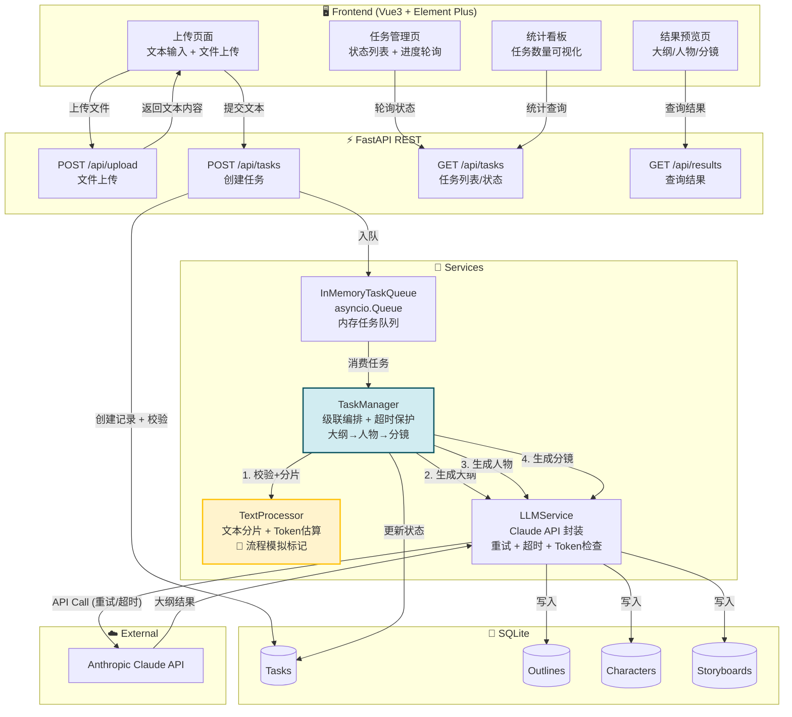
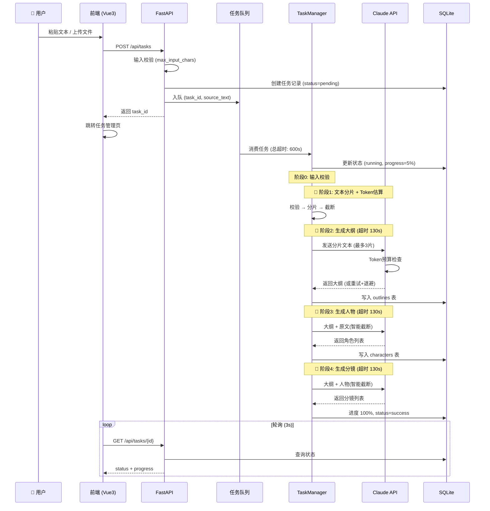

# AIGC 短剧工作台

> **个人 Demo 项目** —— AI 辅助短剧剧本生成工作流。

---

## 项目简介

本项目实现一条完整的 **AI 级联生成链路**：

```
原著文本 → 文本分片预处理 → 剧本大纲 → 人物角色设定 → 分镜脚本
```

支持文本粘贴与文件上传两种输入方式，异步任务处理，前端轮询展示进度和结果。

### 业务功能

| 功能 | 说明 |
|------|------|
| 📝 文本输入 | 文本框粘贴 + .txt 文件上传 |
| 🔪 文本预处理 | 段落感知分片、token 估算、超大文本自动截断 |
| 🤖 LLM 级联链路 | 大纲 → 人物 → 分镜（3 阶段 Claude API 调用） |
| ⚡ 异步任务 | asyncio.Queue 内存队列、进度实时更新、前端 3s 轮询 |
| 📊 统计看板 | 任务总数 / 状态分布 / CSS 柱状图 |
| 🛡️ 边界保护 | 输入校验、API 重试、阶段超时、友好错误提示 |

### Demo 能力边界

| ✅ 有 | ❌ 不实现 |
|-------|----------|
| 文本输入（粘贴 + 文件上传） | 登录 / 注册 / 鉴权 |
| 长文本分片预处理（流程模拟） | 真正的视频 / 多媒体生成 |
| LLM 级联链路（大纲→人物→分镜） | 支付 / 会员体系 |
| 异步任务队列（内存模拟） | Redis / RabbitMQ 等中间件 |
| 任务状态管理 + 进度轮询 | 多用户并发管理 |
| 结果预览（大纲/人物卡/分镜） | 企业级权限系统 |
| 极简统计看板 | CI/CD / K8s |
| **大文本校验 & Token 估算** | 完整七层提取算法（仅做流程模拟标记） |
| **API 重试 & 超时保护** | - |
| **Docker 一键部署** | - |

### 核心复杂算法说明

- `text_processor.py` 标记了 `【此处商业项目实现七层提取与节点重构算法，Demo仅做流程模拟】`
- 商业版本（「剧小白」）包含完整的七层提取、节点重构、角色关系图谱等私有算法
- 本项目仅做简单的段落感知分片，用于展示流水线架构能力

---

## 技术栈

| 层级 | 技术 | 说明 |
|------|------|------|
| 后端框架 | Python FastAPI 0.115 | 异步 REST API |
| ORM | SQLAlchemy 2.0 | 同步引擎 + async to_thread |
| 数据库 | SQLite | 本地文件数据库，零配置 |
| AI 能力 | Anthropic Claude API | Sonnet 5 模型 |
| 前端框架 | Vue 3.5 | Composition API + script setup |
| UI 组件库 | Element Plus 2.9 | Bento Grid + AI Purple 主题 |
| 样式 | SCSS | 完整设计 Token 系统 |
| 构建工具 | Vite 6.0 | HMR 开发 + 生产构建 |
| 任务队列 | asyncio.Queue | 内存模拟（重启丢失） |
| 容器化 | Docker + Compose | 多阶段构建 |

---

## 系统架构



### 级联任务链路（带边界保护）



---

## 本地启动

### 环境要求

- Python 3.11+
- Node.js 20+
- Claude API Key（[console.anthropic.com](https://console.anthropic.com) 获取）

### 方式一：Docker Compose（推荐）

```bash
# 1. 克隆项目
git clone <your-repo-url> && cd aigc_project

# 2. 配置 API Key
cp backend/.env.example backend/.env
# 编辑 backend/.env，填入 ANTHROPIC_API_KEY

# 3. 一行启动
ANTHROPIC_API_KEY=sk-ant-xxxx docker compose up -d

# 4. 访问
open http://localhost:8000
```

> Docker 镜像内同时包含前端（Vite 构建产物由 FastAPI 托管）和后端，无需单独启动前端。

### 方式二：本地开发模式

```bash
# ── 后端 ──
cd backend
python -m venv venv
source venv/bin/activate   # Windows: venv\Scripts\activate
pip install -r requirements.txt
cp .env.example .env       # 编辑填入 ANTHROPIC_API_KEY
uvicorn app.main:app --host 127.0.0.1 --port 8000 --reload

# ── 前端（新终端） ──
cd frontend
npm install
npm run dev
```

| 服务 | 地址 |
|------|------|
| 前端页面 | http://localhost:5173 |
| API 文档 (Swagger) | http://127.0.0.1:8000/docs |
| 健康检查 | http://127.0.0.1:8000/api/health |

---

## 使用示例

### 场景：将小说片段改编为短剧

**1. 上传页面**

打开 `http://localhost:5173`，在"上传任务"页：

- 输入任务名称：`斗破苍穹 · 第一章改编`
- 粘贴原著文本（或拖拽 .txt 文件上传）
- 点击 "🚀 提交生成任务"

**2. 任务管理**

自动跳转到任务管理页，看到任务状态变化：

```
待处理 → 生成中 (进度条递增) → 已完成
```

轮询每 3 秒自动刷新，活跃任务有脉冲指示器。完成后点击「查看结果」。

**3. 结果预览**

Bento Grid 三栏展示：
- **📋 剧本大纲**：结构化大纲（幕/场景/时长）
- **🎭 人物角色**：卡片网格，每张卡展示角色设定
- **🎬 分镜脚本**：时间线样式，按序号排列

**4. 统计看板**

查看累计统计：任务总数、完成率、状态分布柱状图。

### API 调用示例

```bash
# 创建任务
curl -X POST http://127.0.0.1:8000/api/tasks \
  -H "Content-Type: application/json" \
  -d '{"title":"测试任务","content":"江南三月，烟雨朦胧。李清尘背着行囊站在渡口...","source_type":"text"}'

# 查询任务状态
curl http://127.0.0.1:8000/api/tasks/{task_id}

# 获取大纲
curl http://127.0.0.1:8000/api/results/{task_id}/outline

# 获取统计
curl http://127.0.0.1:8000/api/tasks/stats
```

### 文件上传示例

```bash
curl -X POST http://127.0.0.1:8000/api/upload \
  -F "file=@novel_chapter1.txt"
```

---

## 边界保护机制

### 输入校验

| 场景 | 处理 |
|------|------|
| 空文本 | `ValueError` → 前端提示 |
| 超长文本 (>200,000 字) | `InputTooLargeError` → 拒绝并提示上限 |
| 分片后无内容 | `EmptyChunksError` → 提示检查格式 |

### API 调用保护

| 场景 | 策略 |
|------|------|
| API 超时 | 单次 120s 超时，阶段级 130s 超时，总任务 600s 超时 |
| 服务端 5xx | 自动重试（最多 2 次），指数退避（2s → 4s） |
| Token 超限 | 预估算 + 智能截断 + API 精确校验兜底 |
| Rate Limit | 退避重试，失败后友好提示 |
| 网络错误 | 重试 + 异常映射为可读消息 |

### 文本截断策略

```
阶段2 (大纲): 取前 3 个分片送入 LLM
阶段3 (角色): 根据大纲 token 估算，智能截取原文
阶段4 (分镜): 根据大纲 token 估算，智能截取角色文本
```

### 错误消息友好化

所有异常统一映射为中文用户可读消息，例如：
- `"Token 超出限制。建议缩短输入文本或减少分片数。"`
- `"输入文本过长（200000 字符上限），请缩短后重试"`
- `"任务执行超时（600 秒），请尝试缩短输入文本"`

---

## 项目目录结构

```
aigc_project/
├── README.md
├── .gitignore
├── .dockerignore
├── Dockerfile                        # 多阶段构建
├── docker-compose.yml                # 一键启动
├── backend/
│   ├── requirements.txt
│   ├── .env.example
│   └── app/
│       ├── main.py                   # FastAPI 入口 + 生命周期
│       ├── config.py                 # 配置管理（含LLM/超时参数）
│       ├── database.py               # SQLite + get_db 依赖
│       ├── models/                   # ORM 模型
│       │   ├── task.py
│       │   ├── outline.py
│       │   ├── character.py
│       │   └── storyboard.py
│       ├── schemas/                  # Pydantic Schema
│       │   ├── task.py
│       │   ├── outline.py
│       │   ├── character.py
│       │   └── storyboard.py
│       ├── routers/                  # API 路由
│       │   ├── upload.py
│       │   ├── task.py
│       │   └── result.py
│       ├── services/                 # 业务逻辑
│       │   ├── text_processor.py     #   文本分片 + 校验 + Token估算
│       │   ├── task_queue.py         #   内存异步队列
│       │   ├── task_manager.py       #   级联编排 + 超时保护
│       │   └── llm_service.py        #   Claude API + 重试 + 超时
│       └── utils/
│           └── exceptions.py         # 自定义异常 + handler
├── frontend/
│   ├── package.json
│   ├── vite.config.js
│   └── src/
│       ├── main.js
│       ├── App.vue                   # Glassmorphism 导航
│       ├── router/index.js
│       ├── api/                      # Axios 封装
│       │   ├── index.js
│       │   ├── upload.js
│       │   └── task.js
│       ├── utils/markdown.js         # Markdown 渲染器
│       ├── views/                    # 4 个页面
│       │   ├── UploadView.vue
│       │   ├── TaskListView.vue
│       │   ├── ResultView.vue
│       │   └── DashboardView.vue
│       ├── components/               # 6 个可复用组件
│       │   ├── TextInput.vue
│       │   ├── FileUpload.vue
│       │   ├── TaskTable.vue
│       │   ├── OutlineCard.vue
│       │   ├── CharacterCard.vue
│       │   └── StoryboardCard.vue
│       └── styles/global.scss        # 设计 Token 系统
```

---

## 环境变量参考

| 变量 | 默认值 | 说明 |
|------|--------|------|
| `ANTHROPIC_API_KEY` | (必填) | Claude API 密钥 |
| `ANTHROPIC_MODEL` | `claude-sonnet-5-20250915` | 模型 ID |
| `LLM_MAX_RETRIES` | `2` | API 失败重试次数 |
| `LLM_RETRY_BASE_DELAY` | `2.0` | 重试退避基数（秒） |
| `LLM_CALL_TIMEOUT` | `120` | 单次 API 超时（秒） |
| `TASK_TOTAL_TIMEOUT` | `600` | 任务总超时（秒） |
| `MAX_CHUNK_SIZE` | `8000` | 分片大小（字符） |
| `MAX_INPUT_CHARS` | `200000` | 最大输入字符数 |
| `MAX_CHUNKS_FOR_LLM` | `3` | 送入 LLM 的最大分片数 |
| `DATABASE_URL` | `sqlite:///./aigc_workbench.db` | 数据库路径 |

---

## License

本项目仅用于个人学习，不用于商业用途。
